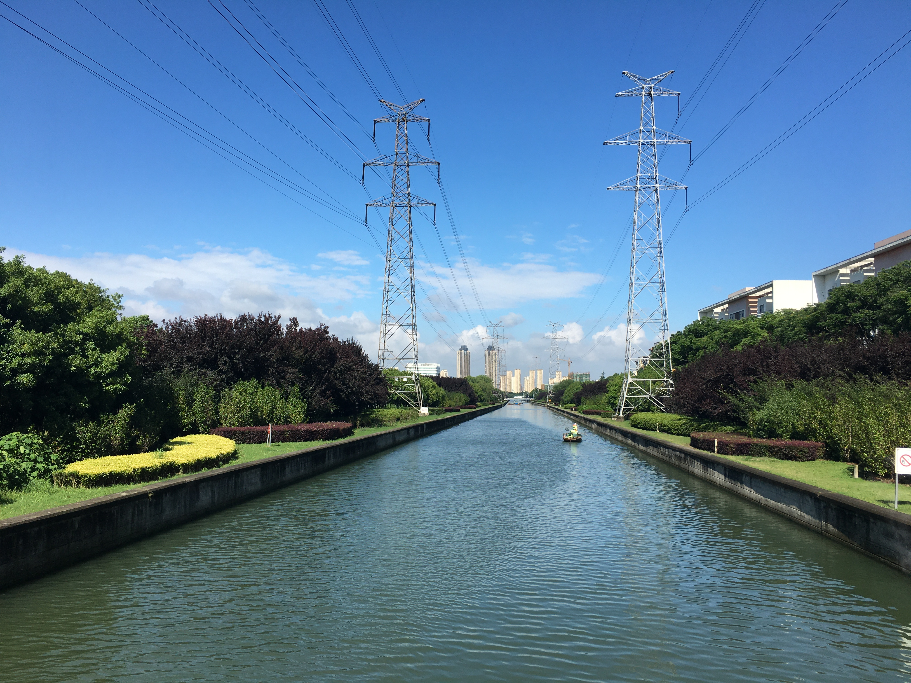

# 科技遇见她

## 分享你与科技的#HERstory

### 一小时编程直播课

#### 等你来挑战

_联合国开发计划署_

_联合国妇女署_

_Coding Girls Club_

> 在联合国＃平等的一代＃倡导活动的框架之下，联合国开发计划署 (UNDP) 与联合国妇女署 (UN Women) 共同发起#HERstory# #科技遇见她#倡议活动，聚焦科技领域，开启故事征集，将许许多多个体的故事回流成川，为广大有志进入科技领域的女性赋予信心。 

##### 在自建的网页中，以图文或短视频的形式，选择以下角度展示你的#科技遇见她 #HERstory

- 你自己突破性别固有印象、在科技相关领域发展的故事

- 你受限于社会传统观念而无法追求自我梦想的故事，以及你内心的期待

- 你身边或者你了解道德某位科技界成功女性代表的故事

## 快来挑战吧！

##### 高二文理分科时，我毫不犹豫地选择了文科，大学选专业的时候又因为自己对外语的兴趣而选择了小语种，算下来到现在我已经做了彻头彻尾7年的文科生。但从15-20年这五年间，互联网行业蓬勃发展，工业方面各类技术迭代也层出不穷，因此我常常自问，作为文科生，我和科技彻底毫无关联了吗？

##### 但是作为一个好奇心旺盛的人，我又不愿放弃探索科技的可能性，我常常利用媒体资讯去关注科技行业和工业界的重要动向；也利用科普账号如Learning Engineering去自我科普一些工程类的基本概念；听说了数学在学习编程方面的重要性后，我又自己去修读了线性代数这类数学课……

##### 在临毕业前选择毕业实习单位时，因为我自己的德语背景我就多关注了在华德企，最后很有幸进到了博世进行实习。在博世，我在软件部门担任项目管理实习生，负责软件项目需求和一些bug的追踪。因为我之前从未正式接触过软件项目开发，因此一开始到岗时我一头雾水，加上公司内部的专有名词，我就更加茫然无措了。但是好在内部有充足的学习资料和交流会，在几个月的环境浸染和自学后，渐渐我也了解了何为敏捷开发，何为软件开发V-Model……

##### 实习进行到第四个月的时候，部门内另一个组的软件工程师突然找到我，问我能不能支持帮忙在内部工具中创建一些特定功能的电子架构信号并在信号和功能之间建立连接。面对这一个任务的时候，我犹豫了一下，因为这涉及到我完全不会的领域，但是和同事确认过后，我还是决定挑战一下自己试一试，毕竟不会的话也还有同事可以请教呀。接下这个任务后，我就用印度同事进行培训的素材进行了自学。但毕竟因为一些知识壁垒的存在，大部分内容我还是一知半解，在之后和印度同事开展的workshop中也是这样的情况，印度同事讲得飞快，而我只能勉强跟上他讲的大章节，具体细节根本无暇顾及。自学无果之后，我最后还是找到了交给我这项任务的同事，请他帮我梳理一下关键的流程和信息。在和他面对面的交流中，我渐渐摸清了整套流程和信号类别，比如Enum信号、布尔信号是什么，随着这些知识逐渐变得清晰，我脑海中也画出了完成这项任务的流程和操作图，之后在一个半工作日之内我就成功创建好了2000个信号并且将它们和具体功能之间进行了连接。

##### 虽然完成这项任务不代表我已经会写程序了，但是它却给了我足够的信心，让我知道，保持好奇，勇于尝试，认真学习， 我也可以去做工程师的任务。在之后小组的每周论坛上，我也依然保持了时刻记录新知识的习惯，慢慢地我发现在听同事分享时，很多名词我可以不依靠google就知道它的含义了，再之后我偶尔会有Aha Moment，“原来是这样啊！”，这种打通知识链的感觉带来的满足感真好。种种新尝试和它们带来的正向反馈都让我再次确定，即使我是文科生，如果我愿意，我与科技之间还是能有千丝万缕的联系，毕竟如今的世界，科技无处不在。
